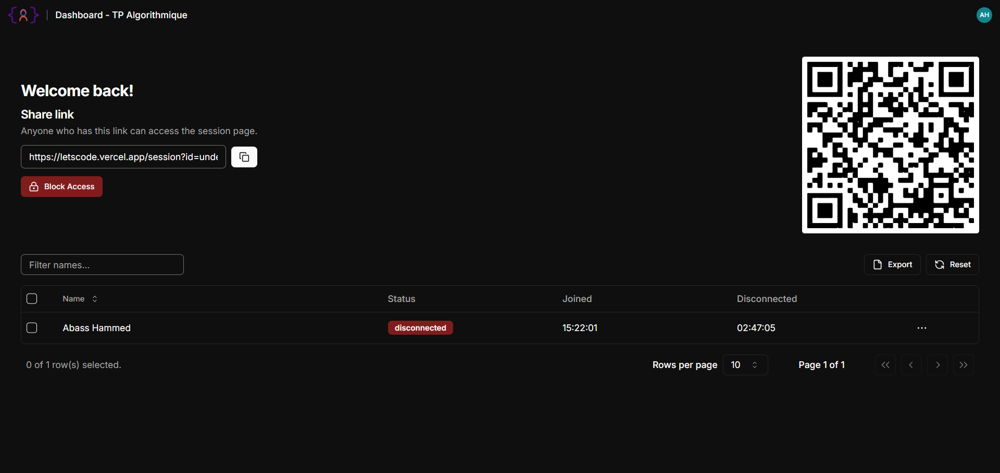

<div align="center">
  
</div>
<h1 align="center">
  LetsCode Online IDE
</h1>


#### The initial intent of this project was to create a session base IDE (I am currently working on the terminal which will be intergrated ) that allows teachers to create a session (they can upload a pdf file) for exams instead of writing code on a paper, students will have to join a session with the session id generated by the teacher when creating the session, after a successful connection they will be directed to the main page, just like in the image below :point_down:, they would be automatically disconnected if thier mouse leaves the page or if they change the window(They will be notified when the mouse is about to leave the page).

## Compiler page :point_down:


## DashBorad for the session Admin :point_down:



## Settings modal


## 🛠 Installation & Set Up

1. Download the repo :up:

   > [click here](https://github.com/AbassHammed/LetsCode)

2. Install and use the correct version of Node using [NVM](https://github.com/nvm-sh/nvm) (`The .nvmrc file precise the exact node version used`)

   ```sh
   nvm install
   ```

3. Install dependencies from the directory path

   ```sh
   npm install
   ```

4. Create your `.env.local` file, copy the `.env.example` with your config

   > Since i am using Firebase for the authentication and database, you will need to create an app on Firebase and copy your App Firebase API key etc

5. Start the development server

   ```sh
   npm run dev
   ```

## 🚀 Building and Running for Production

1. Generate a full static production build

   ```sh
   npm run build
   ```

1. Preview the site as it will appear once deployed

   ```sh
   npm run start
   ```
